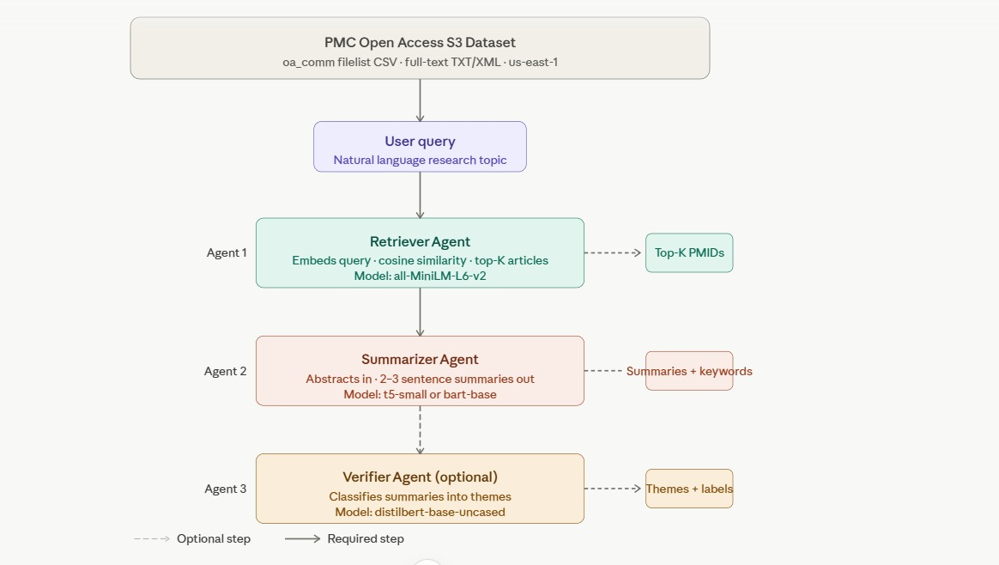

# Scientific Literature Retrieval & Summarization Pipeline

This repository contains an automated, multi-agent pipeline designed to intelligently search, retrieve, extract, summarize, and classify scientific articles from the PubMed Central (PMC) Open Access dataset.

## 🏗️ Architecture

The pipeline is divided into four distinct sequential agents/tiers to optimize processing time and memory usage:

1. **Data Ingestion Tier:** Uses the NCBI E-utilities API to find relevant PMCIDs, then anonymously downloads the corresponding full-text `.txt` files directly from the `pmc-oa-opendata` AWS S3 bucket. A text cleaner scrubs academic boilerplate (e.g., copyright notices, funding disclosures).
2. **Extractor Agent:** Embeds the cleaned document paragraphs and the user's query into vector space. It calculates cosine similarity, extracting and retaining only the chunks that meet a strict `>= 0.40` relevance threshold.
3. **Summarizer Agent:** Takes the high-density extracted chunks and generates concise, abstractive scientific summaries (25–75 words). It also includes a term-frequency statistical counter to extract the top 5 keywords.
4. **Verifier Agent:** A zero-shot classification model that categorizes the summarized findings into specific target themes (e.g., "Deep Learning", "Clinical Trial", "Traditional Methods") and assigns a confidence score.

## ⚖️ Design & Tradeoffs

To balance the constraints of CPU-friendly execution, speed, and scientific accuracy, the following architectural and model decisions were made:

* **Retrieval Strategy (Dense Embeddings vs. TF-IDF/BM25):** We utilized dense embeddings with Cosine Similarity for semantic search rather than lexical methods like TF-IDF or BM25. 
    * *Tradeoff:* While TF-IDF is faster and cheaper on the CPU, dense embeddings capture semantic meaning (e.g., matching "mRNA" to "vaccine technology" even if exact words differ). We traded a slight increase in computational cost for significantly higher retrieval accuracy.
* **Embedding Choice (General vs. Domain-Specific):** We utilized `all-MiniLM-L6-v2`. 
    * *Tradeoff:* This model is exceptionally fast, lightweight, and perfect for CPU execution. However, it is trained on general text. For highly technical biomedical literature, a model like `PubMedBERT` would yield more accurate semantic matches, but at the cost of being significantly heavier and slower.
* **Model Selection (Summarization & Classification):** * *Summarization:* While models like `t5-small` are faster, we opted for `facebook/bart-large-cnn`. The tradeoff is a higher memory footprint and slower inference in exchange for generating medically coherent, human-readable abstractive summaries rather than low-quality text.
    * *Classification:* We selected `typeform/distilbert-base-uncased-mnli` over larger LLMs. The tradeoff here favors CPU-friendliness: by using an MNLI variant, we gain zero-shot capabilities without the massive hardware requirements of modern billion-parameter models, though it may lack the nuanced reasoning of a larger model.
* **Agent Architecture (Sequential vs. Parallel):** The pipeline runs sequentially (API → Extractor → Summarizer). 
    * *Tradeoff:* We only pass highly relevant semantic chunks to the Summarizer rather than full-text documents. This drastically reduces inference costs, processing time, and prevents context window overflow. The tradeoff is that we sacrifice deep, document-wide holistic analysis by only summarizing the most relevant fragments.
* **Data Sampling:** Instead of downloading a random subset of 100 articles from the massive PMC corpus, we implemented an API-first approach, using the NCBI API to pre-filter and fetch up to 30 highly relevant articles based on the specific query.
    * *Tradeoff:* This ensures maximum topical representativeness and saves bandwidth, but relies heavily on the NCBI's underlying search algorithm to surface the best initial candidates.
* **Chunking and Context Limit:** Documents are chunked by paragraphs `\n\n`. Before passing to the Summarizer, text is truncated to 1024 characters (`input_text = doc["text"][:1024]`).
    * *Tradeoff:* This guarantees the model won't crash from exceeding maximum token limits. However, the direct tradeoff is that any vital context located at the end of an exceptionally long paragraph will be lost.

## 🔄 Approach Optimization: Why We Changed the Data Flow

The initial project requirements proposed downloading a bulk batch of 50 to 100 articles first, and then performing the search, classification, and summarization locally. 

This approach was inverted to create a much more efficient automation workflow. Downloading 100 dense academic papers blindly wastes massive amounts of bandwidth, storage, and CPU cycles on irrelevant text. 

Instead, this pipeline takes an **API-first approach**. It queries the NCBI API with the target keyword *first* to identify up to 30 highly relevant PMCIDs. The system then downloads *only* those pre-verified documents from S3. This targeted retrieval acts as a preliminary filter, making the downstream LLM processing drastically faster and cleaner.

## ⚙️ Requirements & Installation

To run this notebook, you will need the following libraries:

```bash
pip install boto3 sentence-transformers transformers requests pandas numpy scikit-learn
```
🚀 Execution Statements
To execute the pipeline, simply pass your target queries into the orchestrator function. The final cell of the Jupyter notebook utilizes the following statements to process the case studies:

```Python
# The specific test queries mandated by the case study
test_queries = [
    "Adverse events with mRNA vaccines in pediatrics",
    "Transformer-based models for protein folding",
    "Clinical trial outcomes for monoclonal antibodies in oncology"
]

for q in test_queries:
    run_case_study_pipeline(q)
```
