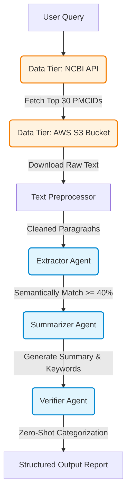

# Multi-Agent Workflow for Biomedical Literature Review

This repository contains a lightweight, multi-agent automated workflow designed to retrieve, summarize, and categorize biomedical literature from the PubMed Central Open Access (oa_comm) dataset.

## 🏗️ Architecture Diagram

The system employs a sequential multi-agent pipeline, enhanced by a dual-tier data ingestion strategy to optimize relevance and performance.



## 🚀 Instructions for Running

### Prerequisites
* **Environment:** The notebook is configured for a Kaggle Python 3 environment, but it can be run locally with Jupyter.
* **Hardware:** All models are CPU-friendly, though a GPU will significantly accelerate the Summarizer and Verifier agents.

### Installation & Setup
1.  **Install Dependencies:** Ensure you have the required libraries installed. 
    ```bash
    pip install boto3 sentence-transformers transformers requests pandas numpy scikit-learn
    ```
2.  **AWS S3 Access:** No AWS credentials are required. The script is configured to use anonymous access to query the public `pmc-oa-opendata` bucket in the `us-east-1` region.
3.  **Execution:** Run the cells in `approach-2.ipynb` sequentially. The environment teardown step will automatically purge old directories to ensure a clean run.

### Running Queries
To test new topics, modify the `test_queries` list in the final execution cell:
```python
test_queries = [
    "Your custom biomedical query here"
]
```

---

## 🧠 Design Choices & Tradeoffs

The implementation deviates from several of the baseline recommendations to account for real-world data sparsity and to prioritize the quality of the scientific outputs. 

### 1. Dual-Tier Data Ingestion (API + S3)
* **The Problem:** Relying purely on the S3 bucket's `oa_comm.filelist.csv` for document retrieval is highly inefficient for dynamic, subject-specific queries without a pre-built search index. Furthermore, some PMC files on S3 are missing or deprecated.
* **The Solution:** The pipeline uses the NCBI `esearch` API as a "Tier 1" filter to fetch highly relevant PMCIDs based on the query. It then uses S3 as a "Tier 2" storage layer to download only the necessary full-text files.
* **Tradeoff:** This introduces an external API dependency. To mitigate missing S3 files, the pipeline intentionally over-fetches (requests up to 30 PMCIDs) to ensure enough valid documents make it to the extraction phase.

### 2. Upgraded Summarizer Model
* **The Problem:** The suggested `t5-small` and `bart-base` models often struggle with highly technical biomedical jargon, occasionally producing hallucinated or grammatically fractured summaries.
* **The Solution:** The summarizer was upgraded to `facebook/bart-large-cnn`. 
* **Tradeoff:** This increases memory consumption and inference time. However, because the extractor agent aggressively filters out irrelevant text, the summarizer only processes small, highly relevant payloads, making the heavier model entirely manageable on a CPU.

### 3. NLI-Based Verifier Agent
* **The Problem:** The suggested `distilbert-base-uncased` model is a base model. Without fine-tuning, it cannot perform multi-class categorization into specific themes like "Deep Learning" or "Clinical Trial".
* **The Solution:** The Verifier leverages `typeform/distilbert-base-uncased-mnli`. This variant is explicitly trained on Natural Language Inference (NLI), allowing it to perform accurate zero-shot classification against arbitrary textual themes without any prior training on this specific dataset.

### 4. Dynamic Semantic Thresholding
* **The Problem:** A standard "Top-K" extraction method will blindly return documents even if the query is fundamentally unrelated to the text, leading to forced, irrelevant summaries.
* **The Solution:** The Extractor Agent embeds the paragraphs using `all-MiniLM-L6-v2` but discards the Top-K constraint. Instead, it extracts *all* paragraphs that meet a strict cosine similarity threshold (0.40 or higher).
* **Tradeoff:** The output size becomes variable (yielding 0 results for the pediatric mRNA query, but 21 results for the protein folding query). This is an intentional design choice to prioritize factual relevance and strict adherence to the query over guaranteed, but potentially hallucinated, output volume.

### 5. Aggressive Boilerplate Filtering
Before embedding, the text undergoes a rigorous cleaning phase. Academic boilerplate (e.g., "conflict of interest," "creative commons") heavily skews semantic embeddings and wastes token space. Removing these dramatically improved the accuracy of the Extractor Agent.
